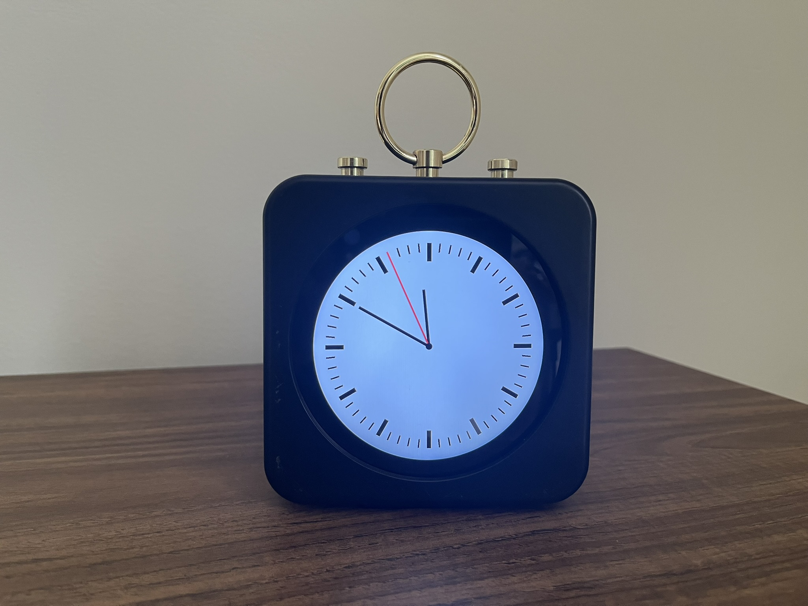

# Portal

A collection of various programs that run on a custom circular display.



## Installation

To build and deploy to a Raspberry Pi:

1. Install [Odin](https://odin-lang.org/) compiler on local machine.
2. Update Makefile `HOST` and `HOME` variables.
3. Run `make dependencies` to install dependencies on Raspberry Pi.
4. Run `make deploy` to build and upload to Raspberry Pi.
5. Add `.env` file with following information:

```
HA_URL=
HA_MEDIA_ENTITY=
HA_TOKEN=
```

6. Start the program using `sudo systemctl start portal.service`

To enable auto-start on boot:

1. Enable console auto-login via `sudo raspi-config` (System Options > Auto Login > Console Autologin)
2. Run `sudo systemctl enable portal.service`.
3. Use `client.sh` to remotely change the scene.

## Logging

To prevent SD card wear, configure logging to RAM (`/run/log/journal`)

1. Enable `journald` volatile storage with memory limits:

```ini
# /etc/systemd/journald.conf
Storage=volatile
RuntimeMaxUse=50M
RuntimeKeepFree=10M
```

2. Restart journald: `sudo systemctl restart systemd-journald`
3. Verify configuration: `journalctl --disk-usage`

## Troubleshooting

> Audio capture is not working or very quiet.

1. Check if microphone is detected: `arecord -l`.
2. Use `amixer`to increase the microphone gain. Note, this is device-dependent; reduce the percentage if the input is too noisy. (e.g., `sudo amixer -c 0 sset 'Mic' 90%`)

